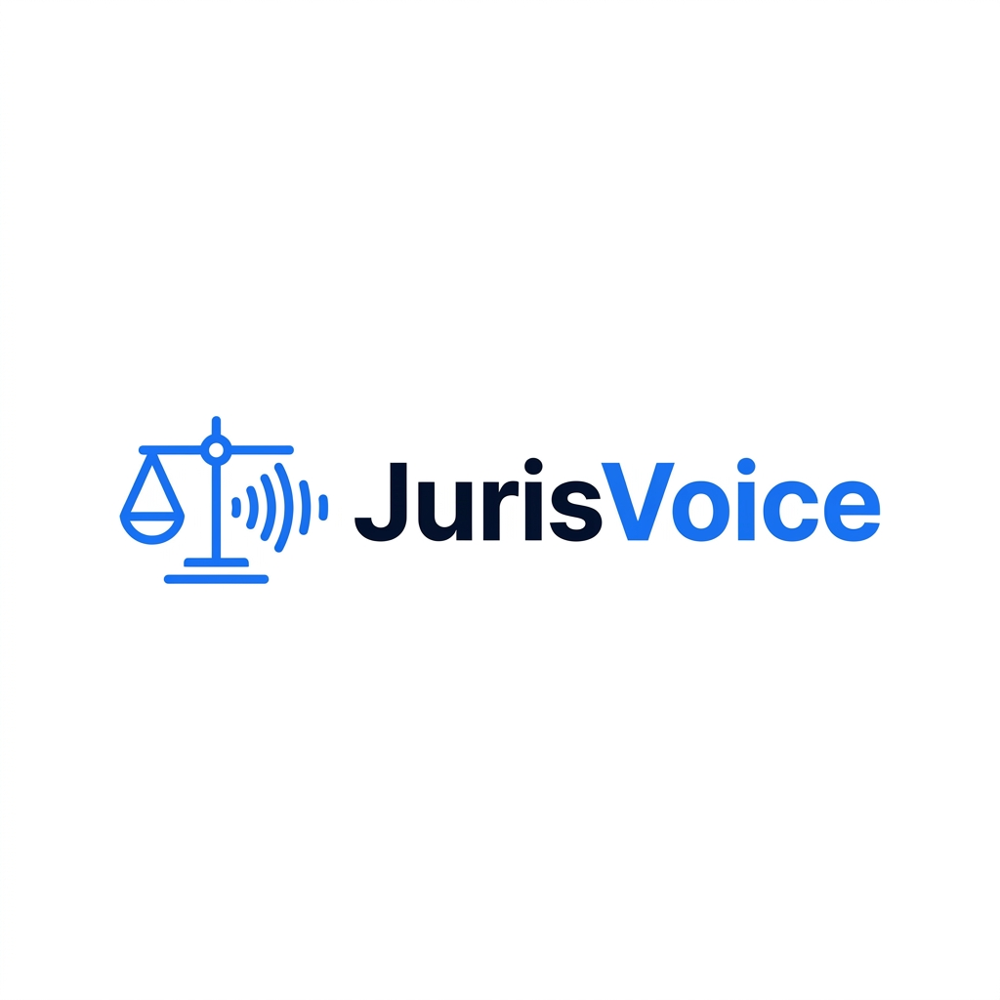
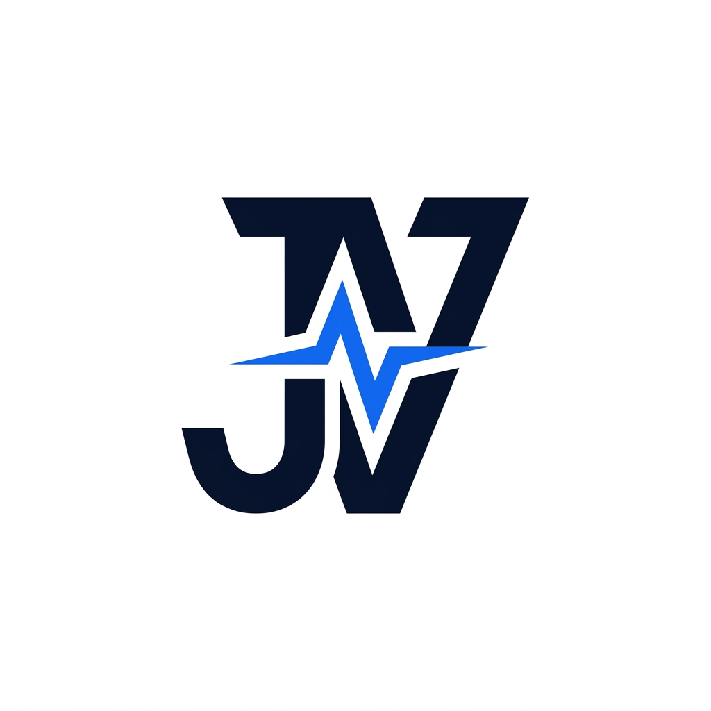
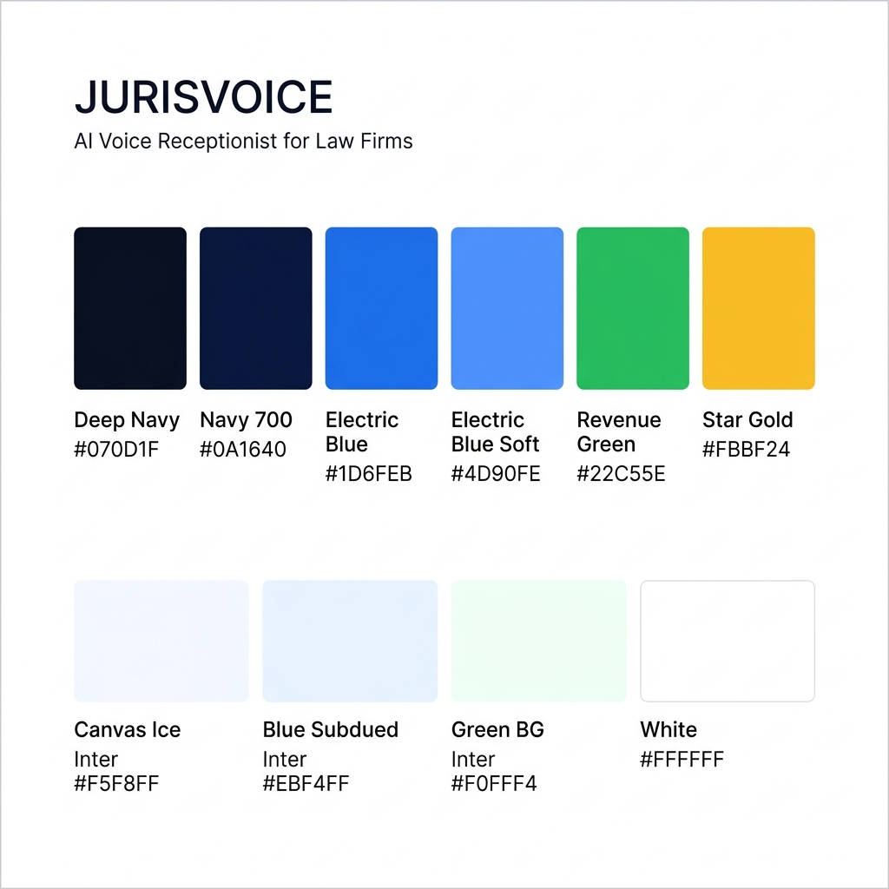
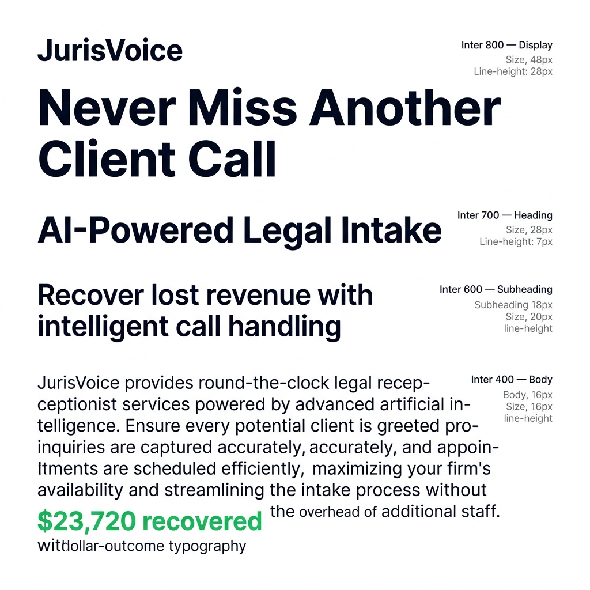
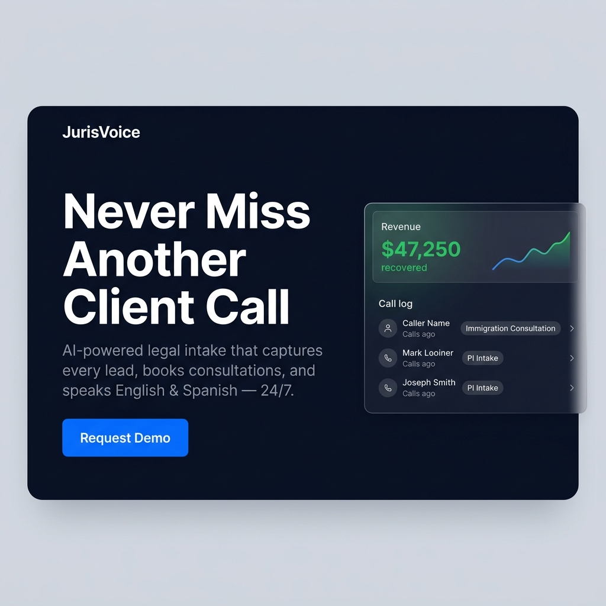
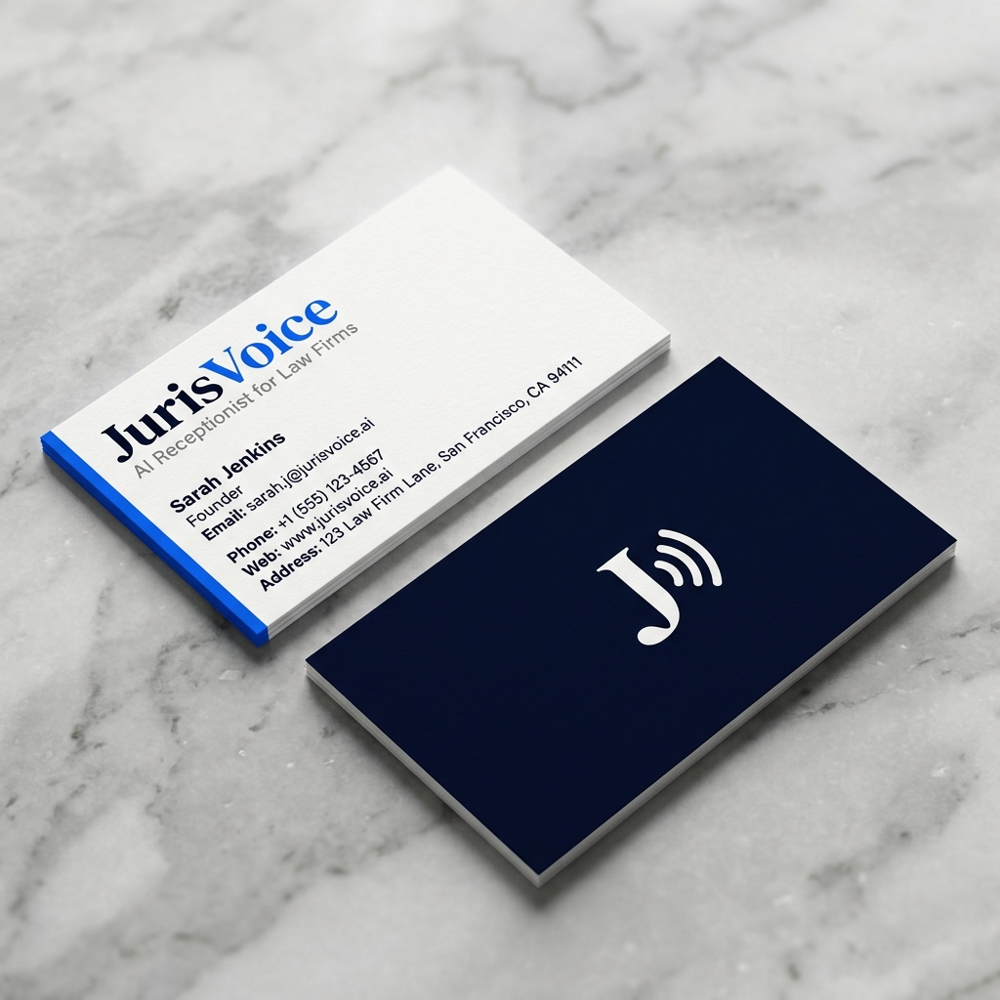

# JurisVoice — Brand Guide

> **AI Receptionist for Law Firms**
> *Never miss another client call.*

---

## 1. Brand Overview

### What Is JurisVoice?

JurisVoice is an AI-powered phone receptionist built exclusively for **immigration and personal injury law firms**. It answers inbound calls 24/7, performs structured client intake, books consultations, detects urgency (arrests, detentions, fresh accidents), and speaks both English and Spanish — replacing expensive human answering services at a fraction of the cost.

### Brand Promise

> *"Every call answered. Every lead captured. Every dollar recovered."*

### Brand Positioning

JurisVoice is not a generic AI phone bot. It's a **legal-intake specialist** — built to understand how law firm front desks work, trained to refuse legal advice, and designed to capture the details attorneys actually need. It replaces Ruby, Smith.ai, and the after-hours voicemail that's losing firms thousands in potential cases.

**We are:**
- The receptionist that never sleeps, never calls in sick, and never forgets to ask for a callback number
- The intake system that speaks the client's language — literally (English + Spanish)
- The revenue recovery tool that turns missed 7pm calls into booked 9am consultations

**We are not:**
- A chatbot
- A legal advisor
- A self-service SaaS platform (we set it up, test it, and manage it for you)

---

## 2. Logo & Identity

### Primary Logo (Wordmark + Icon)



The primary logo combines the **JurisVoice wordmark** with an icon mark that fuses legal symbolism (the scales of justice) with voice/sound waves. "Juris" is rendered in Deep Navy, "Voice" in Electric Blue — the split reinforces the two halves of the brand: legal authority + AI communication.

### Icon Mark (Standalone)



The standalone icon is used for favicons, app icons, social media avatars, and compact placements where the full wordmark doesn't fit.

### Logo Usage Rules

| Rule | ✅ Do | ❌ Don't |
|------|-------|---------|
| Clear space | Maintain padding equal to the height of the "J" on all sides | Crowd the logo against edges, text, or other elements |
| Minimum size | Wordmark: 120px wide / Icon: 32px | Below these sizes the mark becomes illegible |
| Color on light bg | Deep Navy wordmark + Electric Blue accent | Full black, grey, or gradient fills |
| Color on dark bg | White wordmark + Electric Blue accent | Muted or low-contrast versions |
| Modification | Use provided files only | Stretch, rotate, add effects, change typeface |

### Logo Variants

| Variant | Use Case |
|---------|----------|
| **Full Color (Light BG)** | Website header, proposals, pitch deck |
| **White + Blue (Dark BG)** | Dark navy hero sections, footer, dark presentations |
| **Icon Only** | Favicon, app icon, social avatar, watermarks |
| **Monochrome White** | Single-color printing, embossing |

---

## 3. Color System



### Primary Brand Colors

| Color | Hex | Role |
|-------|-----|------|
| **Deep Navy** | `#070D1F` | Headlines, body text, dark section backgrounds, authority signal |
| **Navy 700** | `#0A1640` | Cards/surfaces on dark backgrounds |
| **Navy 500** | `#112060` | Subtle depth layer on navy surfaces |
| **Electric Blue** | `#1D6FEB` | Primary CTA, buttons, links, icon accents — the brand's action color |
| **Electric Blue Deep** | `#1558CC` | Hover state for primary blue |
| **Electric Blue Press** | `#0E3E9A` | Active/pressed state |
| **Electric Blue Soft** | `#4D90FE` | Light accent, eyebrow labels on dark sections |
| **Blue Subdued** | `#EBF4FF` | Pale blue fills, tag backgrounds |

### Semantic Colors

| Color | Hex | Role |
|-------|-----|------|
| **Revenue Green** | `#22C55E` | Dollar amounts ONLY — "$23,720 recovered", case values, ROI proof |
| **Revenue Green BG** | `#F0FFF4` | Pale green chip behind dollar amounts |
| **Star Gold** | `#FBBF24` | 5-star ratings on testimonial/proof cards |

> [!IMPORTANT]
> **Revenue Green is NEVER used for UI decoration.** It appears exclusively on dollar amounts. This conditions the viewer to associate green = money recovered. Breaking this rule dilutes the brand's most powerful visual proof signal.

### Surface & Neutral Colors

| Color | Hex | Role |
|-------|-----|------|
| **Canvas (White)** | `#FFFFFF` | Default page background, light sections |
| **Canvas Ice** | `#F5F8FF` | Alternating card backgrounds, subtle contrast |
| **Hairline** | `#E5E7EB` | 1px borders, dividers |
| **Text Primary** | `#070D1F` | Headlines & body on light backgrounds |
| **Text Secondary** | `#374151` | Sub-headlines, descriptions |
| **Text Muted** | `#6B7280` | Captions, helper text |
| **On Dark** | `#FFFFFF` | Text on dark navy sections |
| **On Dark Muted** | `#9CA3AF` | Body copy on dark sections |

### Color Psychology in Action

```
┌─────────────────────────────────────────────┐
│  DARK NAVY (#070D1F)                        │
│  → Urgency, authority, fear of loss         │
│  "Missed calls cost you thousands"          │
│  [Request Demo] ← Electric Blue button      │
├─────────────────────────────────────────────┤
│  WHITE (#FFFFFF)                            │
│  → Trust, proof, clarity                    │
│  "$23,720 recovered" ← Revenue Green       │
│  ★★★★★ ← Star Gold                         │
│  Call recordings, testimonials              │
├─────────────────────────────────────────────┤
│  DARK NAVY (#070D1F)                        │
│  → Urgency returns, final CTA push         │
│  "Stop losing clients tonight"              │
│  [Request Demo] ← Electric Blue button      │
└─────────────────────────────────────────────┘
```

The **dark/light alternation** is the brand's visual heartbeat. Dark = fear of loss. White = proof of gain. This rhythm never breaks.

---

## 4. Typography



### Font Family

**Inter** — open-source, available on Google Fonts.

Weights used: **400** (body), **600** (subheadings, buttons), **700** (headings), **800** (display/hero).

```css
@import url('https://fonts.googleapis.com/css2?family=Inter:wght@400;600;700;800&display=swap');
```

### Type Scale

| Token | Size | Weight | Tracking | Use |
|-------|------|--------|----------|-----|
| **Display XXL** | 64px | 800 | -1.5px | Hero headline |
| **Display XL** | 48px | 800 | -1.0px | Major section opener |
| **Display LG** | 36px | 700 | -0.5px | Section headlines |
| **Display MD** | 28px | 700 | -0.3px | Card headlines |
| **Heading LG** | 22px | 700 | -0.2px | Feature headings |
| **Heading MD** | 18px | 600 | 0 | Card sub-headings |
| **Heading SM** | 16px | 600 | 0 | Nav items, mini labels |
| **Dollar Outcome** | 20px | 700 | -0.2px | Revenue amounts (green, `tnum`) |
| **Body LG** | 18px | 400 | 0 | Hero subtitle, lead paragraphs |
| **Body MD** | 16px | 400 | 0 | Default body copy |
| **Body SM** | 14px | 400 | 0 | Card body, testimonials |
| **Button MD** | 16px | 600 | 0 | Primary button labels |
| **Eyebrow** | 11px | 600 | 0.08em | Step labels, section tags (UPPERCASE) |
| **Caption** | 13px | 400 | 0 | Footer links, helper text |

### Typography Rules

> [!TIP]
> **Heavy weight IS the brand.** Display tiers always use 700–800. Thin/light weights kill the urgency signal. If a headline doesn't hit you like a punch, the weight is too low.

- All dollar amounts use `font-feature-settings: "tnum"` (tabular figures) so numbers align
- Negative letter-spacing on large sizes only (-1.5px at 64px → 0 at 18px)
- Dollar amounts are always rendered in Revenue Green — never in black or blue
- Eyebrow labels are always UPPERCASE with 0.08em tracking

---

## 5. Voice & Tone

### Brand Personality

| Trait | Description |
|-------|-------------|
| **Authoritative** | We speak with the confidence of someone who's handled 10,000 calls |
| **Direct** | No fluff, no "might", no "could potentially" — we state facts |
| **Empathetic** | We understand that a missed call is a missed person in crisis |
| **Results-obsessed** | Every sentence should connect back to money saved or cases captured |

### Copy Framework: Pain → Proof → Action

Every piece of copy follows this three-act structure:

**Act 1 — Pain (Fear of Loss)**
> Lead with the cost of inaction. Never lead with features.
- "Turn Missed Calls Into Revenue Opportunities"
- "Most firms miss 15–35% of their inbound calls"
- "Every unanswered call at 7pm is a $5,000 case walking to your competitor"

**Act 2 — Proof (Dollar Outcomes)**
> Eliminate skepticism with specific numbers. Never use vague claims.
- "$23,720 recovered from a single after-hours intake"
- "127 consultations booked in the first 30 days"
- Real call recordings — "Listen yourself"

**Act 3 — Action (Single CTA)**
> One ask. One button. Repeated everywhere.
- **Always:** "Request Demo"
- **Never:** "Sign Up", "Try Free", "Get Started", "Learn More"

### Taglines & Headlines

| Placement | Copy |
|-----------|------|
| **Primary tagline** | Never miss another client call. |
| **Hero headline** | Turn Missed Calls Into Signed Cases |
| **Value prop** | AI-powered legal intake. English & Spanish. 24/7. |
| **Fear hook** | Every unanswered call is revenue walking out the door. |
| **Proof hook** | Hear a real intake call that booked a $15,000 case. |
| **CTA support** | Guaranteed ROI or cancel anytime. |
| **After-hours pitch** | Your phone rings at 7pm. Who answers? |
| **Competitor displacement** | Replace your $500/mo answering service with one that never sleeps. |

### Tone Do's and Don'ts

| ✅ Do | ❌ Don't |
|-------|---------|
| "We captured 47 leads last month" | "We can potentially help improve lead capture" |
| "$23,720 — one call, one case" | "Significant revenue improvement" |
| "Your AI receptionist speaks Spanish" | "Multilingual capabilities are available" |
| "Request Demo" | "Get Started on Your AI Journey" |
| "Replaces your answering service" | "Synergizes with your existing workflow" |

---

## 6. Visual Language

### Hero Section Concept



The hero section is the brand's first impression. It follows the ZyraTalk-inspired pattern: **dark navy background, bold white headline left, floating revenue dashboard right.** The dashboard IS the proof — showing real dollar amounts recovered, recent call logs, and an upward trend line. The single Electric Blue "Request Demo" button sits below the subtitle.

### Business Card Concept



### Section Rhythm

The page layout follows a strict **dark/light alternation**:

```
1. HERO         → Dark Navy    (pain + dashboard proof)
2. USE CASES    → White        (dollar-outcome call cards)
3. HOW IT WORKS → White        (4-step process)
4. FEAR HOOK    → Dark Navy    ("Firms Are Losing Revenue")
5. WHY US       → White        (feature grid)
6. TESTIMONIALS → White        (quote cards)
7. FINAL CTA    → Dark Navy    ("Stop Losing Clients Tonight")
8. FAQ          → White        (accordion)
9. FOOTER       → Dark Navy    (links, legal, social)
```

> [!WARNING]
> **Never place two consecutive dark or light sections.** The dark/light rhythm creates a psychological pressure/release cycle. Breaking it removes the urgency pacing.

### Card Types

| Card | Background | Border | Radius | Key Content |
|------|-----------|--------|--------|-------------|
| **Use Case** | White | 1px `#E5E7EB` | 12px | Play button → Dollar amount (green) → Title → ★★★★★ |
| **Feature Icon** | Ice `#F5F8FF` | None | 12px | Blue icon → Heading → Description |
| **Testimonial** | White | 1px `#E5E7EB` | 16px | Avatar → Name → Quote |
| **Revenue Dashboard** | White | 1px `#E5E7EB` | 20px | Revenue total (green) → Trend line → Call log |

### Button Styles

| Button | Background | Text | Border | Use |
|--------|-----------|------|--------|-----|
| **Primary** | `#1D6FEB` | White | None | "Request Demo" — the only CTA |
| **Primary Hover** | `#1558CC` | White | None | Mouse hover state |
| **Primary Pressed** | `#0E3E9A` | White | None | Click/tap state |
| **Ghost (Dark BG)** | Transparent | White | 1px white 30% | Secondary action on navy sections (rare) |

### Elevation

| Level | Shadow | Use |
|-------|--------|-----|
| **0** | None | Default cards on white backgrounds |
| **1** | `0 4px 16px rgba(7,13,31,0.08)` | Feature cards, nav on scroll |
| **2** | `0 20px 60px rgba(7,13,31,0.12)` | Revenue dashboard hero card |
| **Dark band** | Navy fill IS the depth | Fear-hook sections |

---

## 7. AI Voice Agent Personality

The JurisVoice agent itself has a brand-consistent persona:

| Attribute | Specification |
|-----------|--------------|
| **Name** | "Receptionist for [Firm Name]" — never introduces itself as "AI" |
| **Voice** | Professional female, warm but efficient |
| **Languages** | English + Spanish (auto-detect and switch) |
| **Tone** | Calm, reassuring, organized — like the best front desk person you've ever spoken to |
| **Greeting** | "[Firm Name], this is the receptionist. How can I help you today?" |
| **After hours** | "The office is currently closed, but I can take your information and book a consultation." |
| **Legal refusal** | "That's exactly what the attorney will cover in your consultation — I can't provide legal advice, but I'll make sure they have all your details." |
| **Urgency detection** | Keywords: arrest, detained, ICE, accident, hospital → flags as URGENT |
| **Closing** | Confirms all details, states callback expectation ("within one business hour during office hours") |

---

## 8. Asset Checklist

### Phase 1 (Demo Agent — Now)

- [x] Brand name: **JurisVoice**
- [x] Tagline: **"Never miss another client call."**
- [x] Color palette defined
- [x] Typography system defined
- [x] Logo concepts generated
- [x] Voice & tone guidelines
- [x] AI agent personality spec
- [ ] Domain: `jurisvoice.com` (budget: ~$12/yr — purchase when ready for Phase 2)
- [ ] Vapi demo agent configured with brand voice
- [ ] Demo phone number provisioned

### Phase 2 (Outreach — Week 2)

- [ ] One-page pitch PDF using brand colors/typography
- [ ] Email signature with logo + tagline
- [ ] Cold call script incorporating brand voice
- [ ] LinkedIn profile banner

### Phase 3 (Post-First Client)

- [ ] Landing page built with full design system
- [ ] Client-facing weekly report template (branded)
- [ ] Onboarding questionnaire (branded PDF)

---

## 9. Quick Reference — CSS Variables

```css
:root {
  /* Brand Colors */
  --jv-navy-900: #070D1F;
  --jv-navy-700: #0A1640;
  --jv-navy-500: #112060;
  --jv-blue: #1D6FEB;
  --jv-blue-deep: #1558CC;
  --jv-blue-press: #0E3E9A;
  --jv-blue-soft: #4D90FE;
  --jv-blue-subdued: #EBF4FF;
  --jv-green: #22C55E;
  --jv-green-bg: #F0FFF4;
  --jv-gold: #FBBF24;
  
  /* Surfaces */
  --jv-canvas: #FFFFFF;
  --jv-canvas-ice: #F5F8FF;
  --jv-hairline: #E5E7EB;
  
  /* Text */
  --jv-text-primary: #070D1F;
  --jv-text-secondary: #374151;
  --jv-text-muted: #6B7280;
  --jv-on-dark: #FFFFFF;
  --jv-on-dark-muted: #9CA3AF;
  
  /* Typography */
  --jv-font: 'Inter', 'SF Pro Display', system-ui, -apple-system, sans-serif;
  
  /* Spacing */
  --jv-space-xs: 4px;
  --jv-space-sm: 8px;
  --jv-space-md: 12px;
  --jv-space-lg: 16px;
  --jv-space-xl: 24px;
  --jv-space-2xl: 32px;
  --jv-space-section: 80px;
  --jv-space-hero: 120px;
  
  /* Radius */
  --jv-radius-sm: 6px;
  --jv-radius-md: 8px;
  --jv-radius-lg: 12px;
  --jv-radius-xl: 16px;
  --jv-radius-2xl: 20px;
  --jv-radius-pill: 9999px;
}
```

---

## 10. Brand Do's and Don'ts

### ✅ Do

- Use Electric Blue exclusively for CTAs and interactive elements
- Reserve Revenue Green for dollar amounts — it's the brand's proof signal
- Maintain the dark/light section rhythm on all pages
- Show specific dollar outcomes, not vague claims
- Use Inter at weight 700–800 for all headlines
- Apply tabular figures (`tnum`) on every numeric/monetary element
- Repeat "Request Demo" at every section transition
- Let the revenue dashboard be the first thing visitors see

### ❌ Don't

- Use green for UI decoration, icons, or anything non-monetary
- Break the dark/light alternation (never two consecutive same-background sections)
- Add a "Sign Up" or "Try Free" button — demo-only is the conversion strategy
- Use thin/light font weights on headlines
- Add a pricing page before Phase 3
- Use vague social proof ("thousands of clients served")
- Add decorative gradients or mesh backgrounds
- Call the AI agent by a human name or reveal it's AI to callers

---

*JurisVoice — AI Receptionist for Law Firms*
*© 2026. All rights reserved.*
